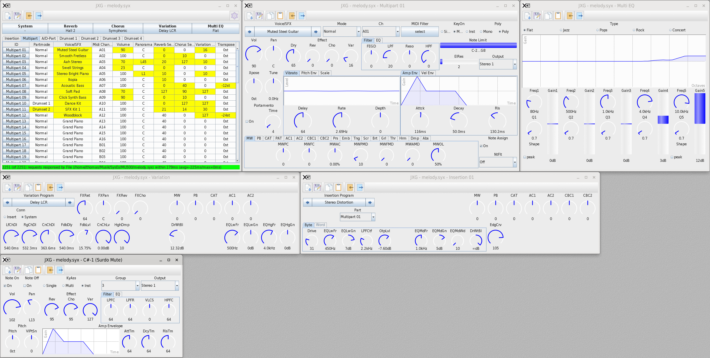

# JXG
Java XG-Editor

Simple small Editor for XG-Devices close to Yamaha-XG-Specification 2.00 of April 2001.
You can find a runnable jar in /out/artifacts.
By default, the specs are readed by the following files in the ".jar/xml/devices/XG"-directory:
defaults.xml = defaultvalues,
drums.xml = drumnames,
parameter.xml = parameterspecification,
device.xml = devicestructure,
tables.xml = tables for valuetranslation and
template.xml = configuration for editorwindows.
You can customize your device by a copy (one or more of) these files in a folder (named as your device) inside the jar-file xml/devices/,
edit it for device preferences and select (or detect) devicename in settingswindow. Now the specs will be overridden by the available specs of the xml-file in your device-folder (missed files will be used from the XG-folder).
If you have got more than one XG-device, you can rename or move the configfile (by default jxgedit.xml beside the jar) as you like and hand over them to the jar at the start (e.g. java -jar '/home/thomas/programs/jxgedit/jxgedit.jar' '/home/thomas/.config/jxgedit/MU80.config').

